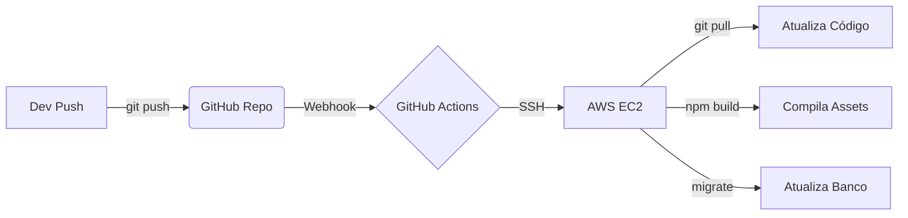

# ☕ Hub do Café


> **Projeto Acadêmico / Portfólio** - Sistema de Gestão e E-commerce para Cafeteria Gourmet.

<div align="center">
    <h4>Projeto Integrador Transdisciplinar - Sistemas de Informação II</h4>
    <p>
        <b>Autor:</b> Renan Douglas de Souza &bull; <b>RGM:</b> 31228348<br>
        <b>Universidade:</b> Cruzeiro do Sul Virtual &bull; <b>Data:</b> Novembro 2025
    </p>
</div>

---

## 📖 Sobre o Projeto

O **Hub do Café** é uma plataforma completa que une um e-commerce moderno para clientes e um sistema de gestão (ERP) robusto para administradores.

O objetivo é oferecer uma experiência fluida de pedido online ("Just-in-time") e fornecer ferramentas poderosas para a gestão de cardápio, pedidos e entregas em tempo real.

### 🚀 Diferenciais Técnicos & DevOps
Este projeto vai além do código, implementando uma esteira de DevOps completa:
* **Infraestrutura Cloud:** Hospedado em **AWS EC2** com IP Elástico.
* **CI/CD Pipeline:** Deploy automatizado via **GitHub Actions**. Todo push na branch `main` aciona um workflow que atualiza o servidor, instala dependências e roda migrations automaticamente.
* **Servidor Web:** Alta performance com **Nginx** e **PHP-FPM**.
* **Banco de Dados:** Escalabilidade com **PostgreSQL self-hosted**.
* **Segurança:** Tráfego protegido por **Cloudflare (SSL Full Strict)** e firewall configurado.
* **Frontend Moderno:** Build de assets em produção otimizado com **Vite**.

---

## 🛠️ Tecnologias Utilizadas

### Backend & Infraestrutura & DevOps
-   **PHP 8.3+** & **Laravel 12**
-   **Redis** (Cache, Session, Queue)
-   **PostgreSQL** (Database self-hosted)
-   **AWS EC2** (Compute/Linux Ubuntu 24.04)
-   **Nginx** (Web Server)
-   **GitHub Actions** (CI/CD)
-   **Cloudflare** (DNS & Security)

### Frontend
-   **Blade Templates:** Uso avançado de **Componentes (x-components)** para modularização e reutilização de interface.
-   **Tailwind CSS** (Estilização Utility-First)
-   **Alpine.js** (Interatividade JavaScript)
-   **Vite** (Asset Bundling)
-   **TailAdmin** (Base de UI para Dashboard)
-   **ApexCharts** (Dashboards Visuais)

### 🔄 Fluxo de Deploy Automatizado


---

## ✨ Funcionalidades

### 👤 Para o Cliente
-   [x] Visualização de Cardápio Gourmet.
-   [x] Adição de itens ao carrinho.
-   [x] Checkout simplificado (Cadastro "Just-in-Time" no primeiro pedido).
-   [x] Gestão de Endereços de Entrega.
-   [x] Histórico de Pedidos.

### 🛡️ Para o Administrador (ERP)
-   [x] **Dashboard:** Métricas de vendas e pedidos em tempo real.
-   [x] **Gestão de Produtos:** CRUD completo com upload de imagens.
-   [x] **Gestão de Pedidos:** Alteração de status (Recebido, Em Preparo, Saiu para Entrega).
-   [x] **Controle de Usuários:** Gerenciamento de clientes e funcionários (RBAC).

---

## ⚙️ Como Rodar Localmente

Siga os passos abaixo para rodar o projeto na sua máquina:

### Pré-requisitos
-   PHP 8.3+
-   Composer
-   Node.js 20+ (LTS)
-   Git

### Instalação

1.  **Clone o repositório**
    ```bash
    git clone [https://github.com/seu-usuario/hub-do-cafe.git](https://github.com/seu-usuario/hub-do-cafe.git)
    cd hub-do-cafe
    ```

2.  **Instale as dependências do Backend**
    ```bash
    composer install
    ```

3.  **Instale as dependências do Frontend**
    ```bash
    npm install
    ```

4.  **Configure o Ambiente**
    ```bash
    cp .env.example .env
    php artisan key:generate
    ```
    *Configure suas credenciais de banco de dados (SQLite ou Postgres) no arquivo `.env`.*

5.  **Rode as Migrations e Seeders**
    ```bash
    php artisan migrate:fresh --seed
    ```
    *Isso criará o Admin (admin@hubdocafe.com) e Cliente de teste.*

6.  **Inicie o Servidor**
    ```bash
    compose run dev
    ```

7.  **Acesse:** `http://localhost:8000`

---

## 👏 Créditos e Agradecimentos

* **Interface Admin:** O layout do painel administrativo utiliza como base o [TailAdmin](https://tailadmin.com) (Free Version), adaptado e componentizado para **Laravel Blade**.
* **Ícones:** [Material Icons](https://fonts.google.com/icons).

---

## 📄 Licença

Este projeto está sob a licença MIT. Desenvolvido para fins acadêmicos.

---

<p align="center">
  Feito com ☕ e 💻 por <a href="https://github.com/seu-usuario">Renan Douglas</a>
</p>
